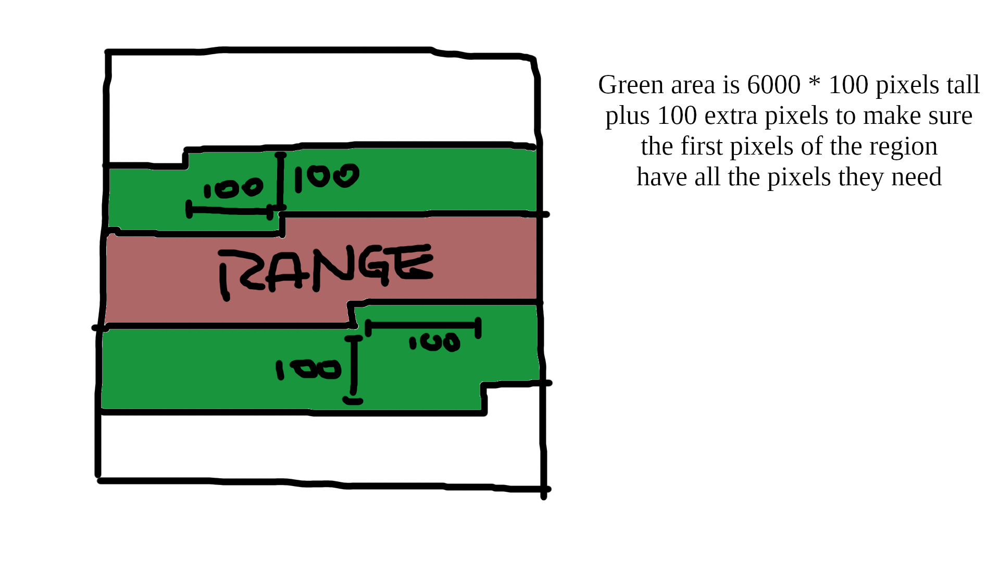

# How to build

1. Enter the directory of the target implementation.
2. `make` then `make run`
   * This should run the program with the maximum number of threads your system
     supports; if this behavior is not desired, modify the Makefile.

# Descriptions

## serial

Pseudocode:

* Read the image from a file.
* For each pixel in the image:
  * Initialize `count` to 0.
  * For each pixel not more than 100 pixels from the source in either direction:
    * Find the Bresenham line between the source and this pixel.
    * If no pixel on has a greater value than this, increment `count`.
  * Save `count` to an output array.
    * Initialize `count` to 0.
* Write the output array to a file.

## shared-cpu

Pseudocode:

* Read the image from a file.
* For each row in the image:
  * Spawn a new thread with OpenMP. On each thread:
    * Initialize `count` to 0.
    * For every `n`th pixel in this row, starting at this thread's rank, where
      `n` is the number of threads, perform the Bresenham line test as above
      for the surrounding pixels within a 100 pixel radius.
* Write the output array to a file.

## distributed-cpu

Psuedocode:

* On rank 0: Read the image from a file.
* On rank 0: Create `comm_size` equal slices of the image.
  * To this range, add enough surrounding pixels on either side so that the 100
    pixel radius for all pixels is satisfied; this will be `width * 100 + 100`
    pixels.
    
  * Distribute these slices to each MPI process.
* On each MPI process:
  * For each pixel in the image, starting at the beginning of this process's
    slice and ending at the end of this process's slice, perform the Bresenham
    line test as above for the surrounding pixels within a 100 pixel radius.
* On rank 0:
  * Collect all of the worker processes' output slices and combine them into an
    output array.
  * Write the output array to a file.
