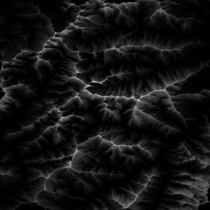

# How to build

1. Enter the directory of the target implementation.
2. `make` then `make run`
   * This should run the program with the maximum number of threads your system
     supports; if this behavior is not desired, modify the Makefile.

# Descriptions

## serial

Pseudocode:

* Read the image from a file.
* For each pixel in the image:
  * Initialize `count` to 0.
  * For each pixel not more than 100 pixels from the source in either direction:
    * Find the Bresenham line between the source and this pixel.
    * If no pixel on has a greater value than this, increment `count`.
  * Save `count` to an output array.
    * Initialize `count` to 0.
* Write the output array to a file.

## shared-cpu

Pseudocode:

* Read the image from a file.
* For each row in the image:
  * Spawn a new thread with OpenMP. On each thread:
    * Initialize `count` to 0.
    * For every `n`th pixel in this row, starting at this thread's rank, where
      `n` is the number of threads, perform the Bresenham line test as above
      for the surrounding pixels within a 100 pixel radius.
* Write the output array to a file.

## shared-gpu

Pseudocode:

* Read the image from a file.
* Allocate CUDA variables to store the map values and output.
* Copy the map values from host memory into cuda memory.
* Call the cuda_bresenham kernel to compute the elevation results for the dataset.
* Copy the computed output from cuda memory into host memory.
* Write the output array to a file.

## distributed-cpu

Psuedocode:

* On rank 0: Read the image from a file.
* On rank 0: Create `comm_size` equal slices of the image.
  * To this range, add enough surrounding pixels on either side so that the 100
    pixel radius for all pixels is satisfied; this will be `width * 100 + 100`
    pixels.
    
  * Distribute these slices to each MPI process.
* On each MPI process:
  * For each pixel in the image, starting at the beginning of this process's
    slice and ending at the end of this process's slice, perform the Bresenham
    line test as above for the surrounding pixels within a 100 pixel radius.
* On rank 0:
  * Collect all of the worker processes' output slices and combine them into an
    output array.
  * Write the output array to a file.

## distributed-gpu

Psuedocode:

* On rank 0: Read the image from a file.
* On rank 0: Create `comm_size` equal slices of the image.
  * To this range, add enough surrounding pixels on either side so that the 100
    pixel radius for all pixels is satisfied; this will be `width * 100 + 100`
    pixels.
  * Distribute these slices to each MPI process.
* On each MPI process:
  * Allocate CUDA variables to store the map slice and output.
  * Copy the map slice from host memory into cuda memory.
  * Call the cuda_bresenham kernel to compute the elevation results for the dataset.
  * Copy the computed output from cuda memory into host memory.
* On rank 0:
  * Collect all of the worker processes' output slices and combine them into an
    output array.
  * Write the output array to a file.

# Performance study

## cpu comparison
Note: although we have a working distributed-cpu implementation (tested on the smaller 300x300 dataset), we were unable to collect execution timing on the CHPC due to it being down at the time of testing. The CHPC was supposed to be back online by the afternoon of 12/6/22 (due date), but was offline into the late evening. As a compromise, we have completed a scaling study on a laptop with a 8c/16t AMD Ryzen processor and have attempted to extrapolate the distributed-cpu performance given the execution timing we have for the serial and shared-cpu implementations on the CHPC.

## gpu comparison
Note: we were unable to get the distributed-gpu implementation working in time, this section will only cover perfomance of the shared-gpu implementation. The CHPC was supposed to be back online by the afternoon of 12/6/22 (due date), but was offline into the late evening., so we opted to use a laptop with an Nvidia RTX 3060.

The primary thing tested here is the effect that
different grid sizes has on the execution time of our code.
[shared-gpu-timing](visualizations/shared-gpu-timing.png)
As can be seen, the optimal grid size was found to be 8. Using a grid size of 4 results in a large performance loss at almost 2x the execution time compared to 8. Grid sizes of 16 and 32 performed marginally worse than 8, but identically to one another. Our best guess as to why this is the case: grid sizes that are too small result in a large number of grids to work with. Grid sizes that are too large result in fewer grids, but too much work per grid.

# Visualizations

To visualize the raw files, including input as and results, we used both ImageJ
and Paraview. What follows is a JPEG version of the input file, exported from
ImageJ:

Once we produced an output file from the serial implementation we also created
a JPEG export of that. The outputs from the parallel implementations looked
exactly the same, predictably, so the following image can be considered our
generalized output:

During the course of testing, we took a 300x300 sample of the dataset for the
purposes of quicker testing. Here's that file:

And here's the output it produced, which was very similar to the portion of the
output that it rightly should have been:

We also wanted to get a side-by-side of the input and the output. For that
purpose we used Paraview to produce this nice visualization:

